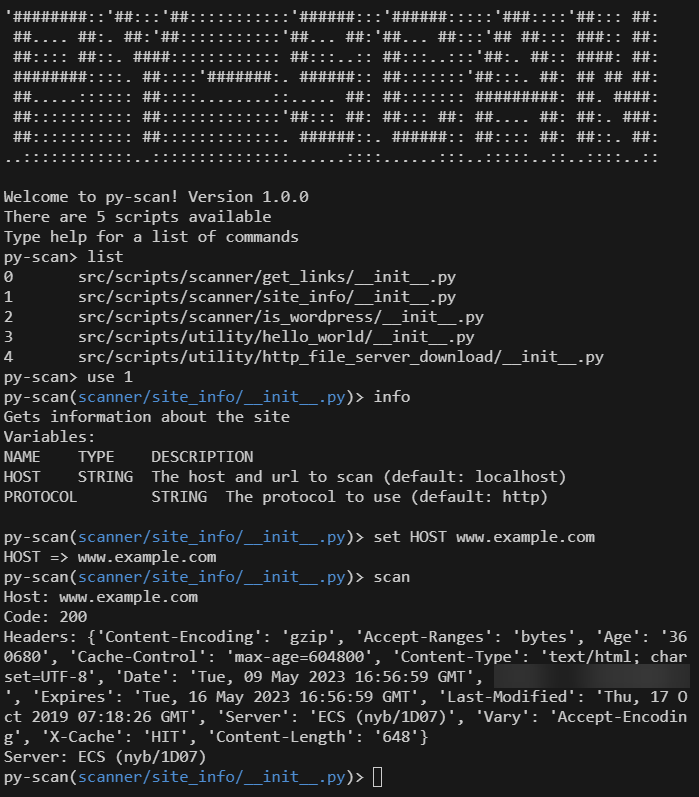

# Py-scan

A metasploit like tool but for scanning and retrieving data from websites.

Pyscan has several scripts built into to it and utilities that can be used to scan websites and retrieve data from them.

You will need requests to use this.

## Demo



## Installation

```bash
git clone
cd pyscan
python3 src/main.py
```

## Usage

```python
python3 src/main.py
```

## Contributing
Pull requests are welcome if you want to add scripts to the tool or fix bugs.